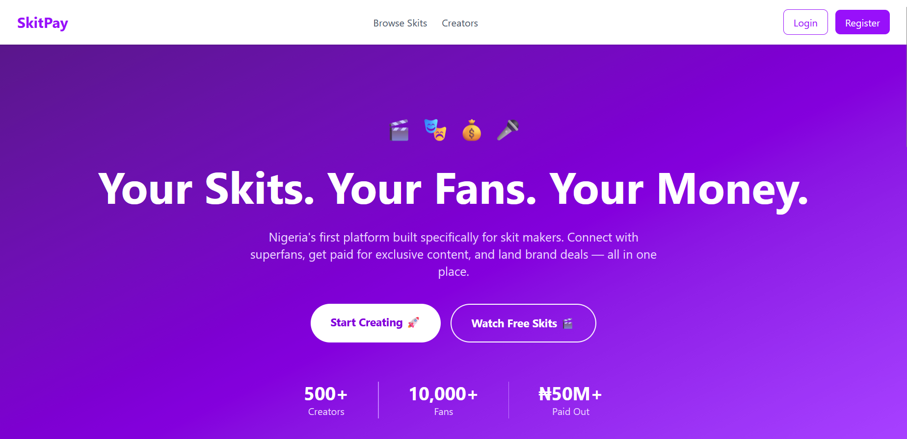
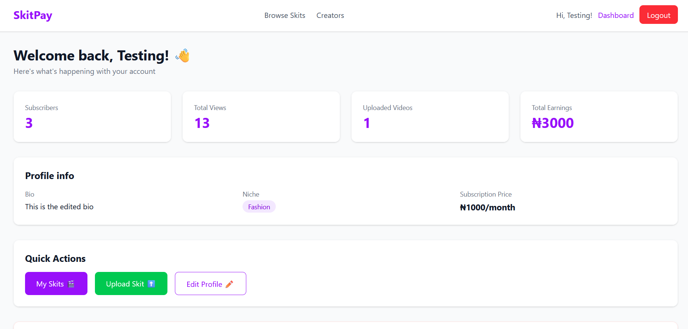
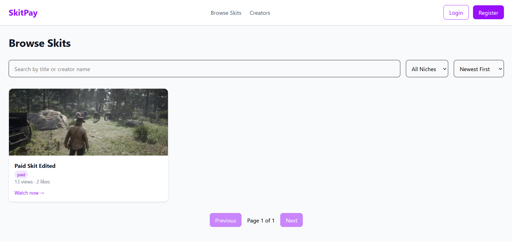
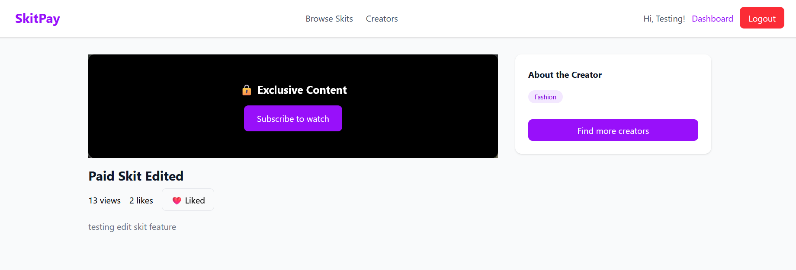
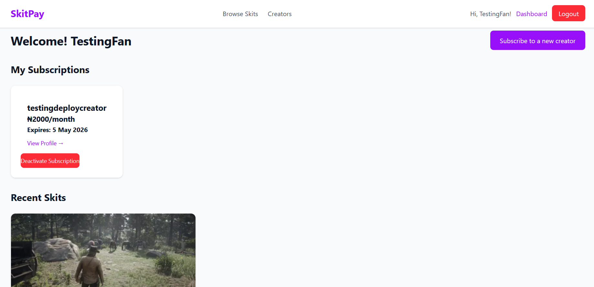

# SkitPay 🎬

Nigeria's first creator monetization platform built specifically for skit makers. Connect with superfans, get paid for exclusive content, and land brand deals — all in one place.

## 🌐 Live Demo
- **Frontend:** https://skitpay.vercel.app
- **Backend:** https://skitpay-backend.onrender.com

## ✨ Features

### For Creators
- Create and manage a public profile with bio, niche and social links
- Upload exclusive skits with video and thumbnail
- Earn from fan subscriptions via Paystack payments
- Real-time notifications for new subscribers and likes
- Analytics dashboard with subscribers, views and earnings
- Account deactivation with 30-day grace period for active subscribers

### For Fans
- Browse and search skits by title or creator name
- Filter by niche and sort by newest, most viewed or most liked
- Subscribe to favourite creators via Paystack
- Access exclusive paid content after subscribing
- Like skits and engage with creators
- Real-time notifications for new skit uploads

## 🛠️ Tech Stack

### Frontend
- React (Vite)
- Tailwind CSS v4
- React Router v6
- Axios
- Socket.io Client
- React Hot Toast
- JWT Decode

### Backend
- Node.js / Express
- MongoDB / Mongoose
- JWT Authentication
- Socket.io
- Cloudinary (video and image storage)
- Paystack (payment processing)
- Multer (file uploads)

## 🏗️ Architecture
Client (React/Vite)
↓ HTTP requests
Express REST API
↓
MongoDB Atlas (database)
↓
Cloudinary (media storage)
↓
Paystack (payments)
Real-time:
Client ←→ Socket.io ←→ Express Server

## 🚀 Getting Started

### Prerequisites
Node.js v18+
MongoDB Atlas account
Cloudinary account
Paystack account

### Installation

**Clone the repository:**
```bash
git clone https://github.com/ToheebA/skitpay.git
cd skitpay
```

**Install server dependencies:**
```bash
cd server
npm install
```

**Install client dependencies:**
```bash
cd client
npm install
```

### Environment Variables

**Server `.env`:**
PORT=5000
MONGO_URI=your_mongodb_uri
JWT_SECRET=your_jwt_secret
JWT_LIFETIME=1d
CLOUDINARY_CLOUD_NAME=your_cloud_name
CLOUDINARY_API_KEY=your_api_key
CLOUDINARY_API_SECRET=your_api_secret
PAYSTACK_SECRET_KEY=your_paystack_secret
PAYSTACK_CALLBACK_URL=http://localhost:5173/payment/verify

**Client `.env.development`:**
VITE_API_URL=http://localhost:5000/api/v1
VITE_SOCKET_URL=http://localhost:5000


### Running Locally

**Start the server:**
```bash
cd server
npm run dev
```

**Start the client:**
```bash
cd client
npm run dev
```

**Open browser at:**
http://localhost:5173/


## 📁 Project Structure
skitpay/
├── client/                 # React frontend
│   ├── src/
│   │   ├── api/           # API functions
│   │   ├── components/    # Reusable components
│   │   ├── context/       # Auth and Socket context
│   │   ├── hooks/         # Custom hooks
│   │   ├── pages/         # Page components
│   │   └── utils/         # Helper functions
│   └── ...
├── server/                 # Express backend
│   ├── config/            # Cloudinary and Socket config
│   ├── controllers/       # Route controllers
│   ├── db/                # Database connection
│   ├── errors/            # Custom error classes
│   ├── middleware/        # Auth and error middleware
│   ├── models/            # Mongoose models
│   └── routes/            # Express routes
└── README.md


## 🔒 Security
- JWT authentication with 1 day expiry
- Token expiry check on app load
- Role based access control (creator/fan/brand)
- Paystack webhook signature verification
- Password hashing with bcrypt
- Case insensitive email handling

## ⚠️ Known Limitations & Future Improvements
- File uploads route through server before Cloudinary — production would use Cloudinary direct upload for better performance
- Earnings display active subscription revenue only — production would implement a Transactions collection for historical payment tracking
- Search uses URL state (useState) — future improvement would use useSearchParams for persistent filters and shareable URLs
- No automated testing — GitHub Actions could be added for CI/CD pipeline
- Free tier Render deployment sleeps after inactivity — production would use paid tier

## 📱 Responsive Design
Fully responsive across mobile, tablet and desktop devices.

## 🔄 Real-time Features
Socket.io powers real-time notifications for:
- New subscriber alerts
- New like alerts  
- New skit upload alerts to subscribers

## 💳 Payment Integration
Paystack handles all payments with:
- Secure webhook signature verification
- Automatic subscription creation on successful payment
- Support for subscription reactivation

## 👨‍💻 Author
Built by Toheeb Olufade
- GitHub: [@ToheebA](https://github.com/ToheebA)

## 📄 License
MIT License


## 📸 Screenshots

### Landing Page


### Creator Dashboard


### Browse Skits Page


### Single Paid Skit


### Fan Dashboard


### Mobile Landing Page


## 📱 Responsive Design

| Desktop | Mobile |
|---------|--------|
|  |  |